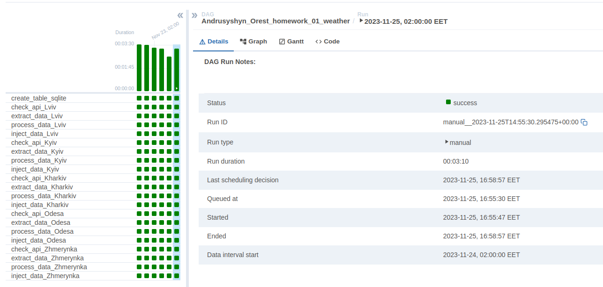
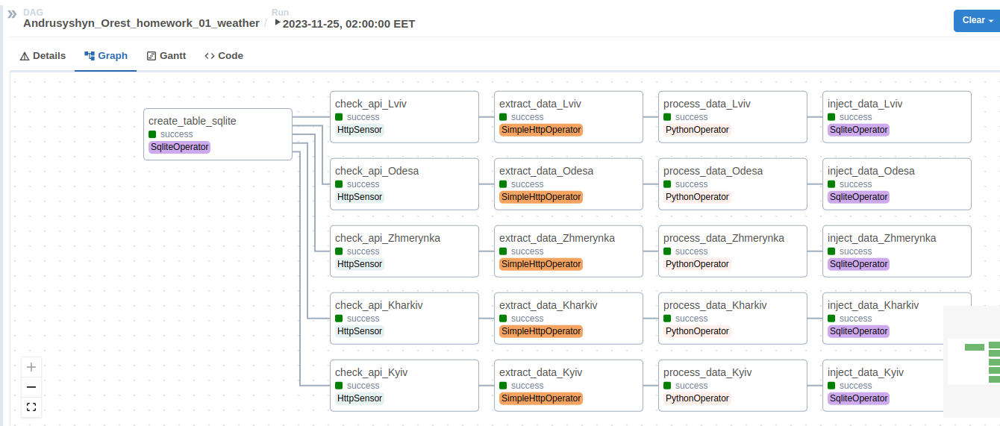
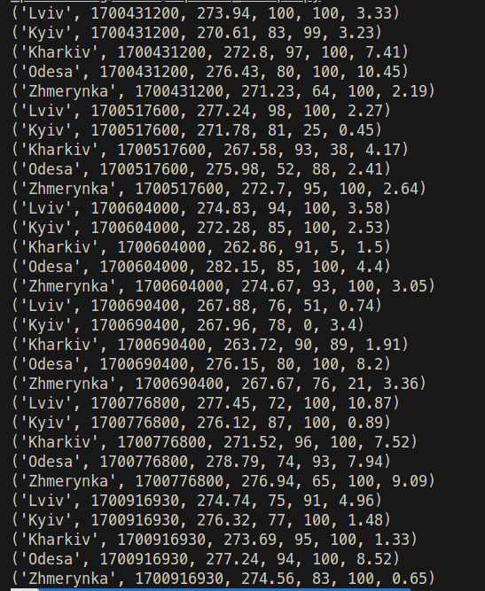

# data_processing_hw1

## Configuration:
To make this dag work you need to create:
1) Sqlite connection airflow_conn_for_weather. Host example: /home/orest/UCU/2023-2024/data_processing/lec01/measures.db
2) HTTP connection airflow_http_weather_conn. Host: https://api.openweathermap.org
3) Variable WEATHER_API_KEY. Val: Your OpenWeather API token.

## Results:
  
  

